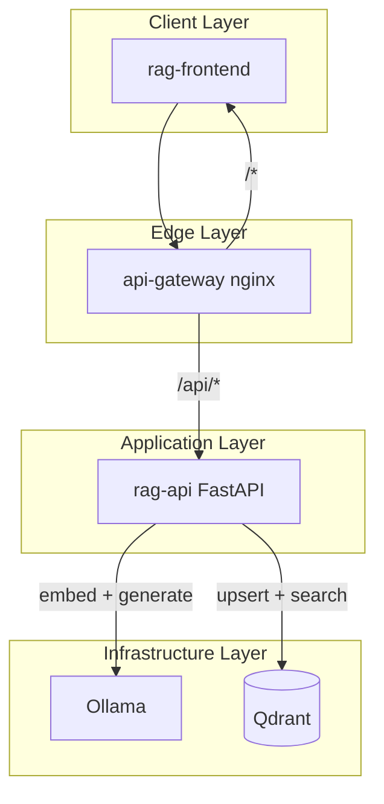
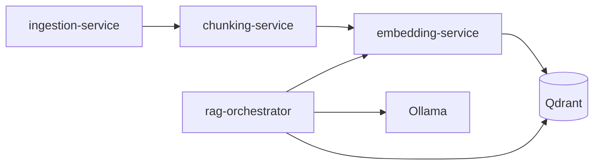

# RAG System Architecture

This document explains how the MVP RAG pipeline works, how components map to Kubernetes resources, and how to evolve the design.

## Goals

- Run fully local on **kind** with no cloud API keys
- Demonstrate every RAG stage clearly
- Keep MVP simple enough for a laptop while leaving room to split into microservices

## High-level diagram



## RAG pipeline stages

The MVP implements all stages inside `rag-api`. Each stage maps to a module under `apps/rag-api/rag/`.

### 1. Ingestion

**Endpoint:** `POST /api/documents`, `POST /api/documents/upload`

- Accepts plain text or UTF-8 files
- Assigns a `doc_id` (UUID)
- Passes content to chunking

**Future service:** `ingestion-service` with object storage (MinIO) and job queue.

### 2. Chunking

**Module:** `rag/chunker.py`

- Splits normalized text into overlapping character chunks
- Defaults: 500 characters, 50 overlap
- Tuned for simplicity; token-based chunking is a Phase 2 improvement

**Future service:** `chunking-service` with pluggable strategies (fixed-size, semantic, markdown-aware).

### 3. Embedding

**Module:** `rag/ollama_client.py`

- Calls Ollama `POST /api/embeddings`
- Model: `nomic-embed-text`
- One vector per chunk

**Future service:** `embedding-service` to batch requests and swap model backends.

### 4. Indexing

**Module:** `rag/qdrant_store.py`

- Creates collection `rag_chunks` on first startup
- Upserts points with payload:
  - `doc_id`, `doc_title`, `chunk_index`, `text`
- Uses cosine distance

**Infrastructure:** Qdrant StatefulSet with PVC (`qdrant-data`).

### 5. Retrieval

**Triggered by:** `POST /api/chat`

1. Embed the user question
2. Search Qdrant for top-k similar chunks
3. Return scored context snippets

### 6. Generation

**Module:** `rag/ollama_client.py`

- Builds a grounded prompt from retrieved chunks
- Calls Ollama `POST /api/generate`
- Model: `llama3.2:3b`
- Instructs the model to answer only from context

## Request flows

### Document ingest flow

```text
1. User submits title + content in UI
2. Frontend POST /api/documents
3. api-gateway proxies to rag-api
4. rag-api chunks text
5. rag-api embeds each chunk via Ollama
6. rag-api upserts vectors into Qdrant
7. Response: doc_id, chunk_count
```

### Chat flow

```text
1. User submits question
2. Frontend POST /api/chat
3. rag-api embeds question via Ollama
4. rag-api searches Qdrant (top_k)
5. rag-api builds prompt with retrieved chunks
6. rag-api calls Ollama generate
7. Response: answer + source citations
```

## Kubernetes resources

| Resource | Name | Purpose |
|----------|------|---------|
| Namespace | `rag-system` | Isolates all RAG workloads |
| Deployment | `qdrant` | Vector database |
| PVC | `qdrant-data` | Persists vectors across restarts |
| Deployment | `ollama` | LLM + embedding runtime |
| Job | `ollama-model-pull` | Downloads models on first deploy |
| Deployment | `rag-api` | RAG pipeline API |
| Deployment | `rag-frontend` | Static UI |
| Deployment | `api-gateway` | Single HTTP entry point |
| Service | `api-gateway` (NodePort 30080) | Maps to localhost:8080 |

## Networking

Inside the cluster:

| Service | DNS | Port |
|---------|-----|------|
| rag-api | `rag-api.rag-system.svc.cluster.local` | 8000 |
| rag-frontend | `rag-frontend.rag-system.svc.cluster.local` | 80 |
| ollama | `ollama.rag-system.svc.cluster.local` | 11434 |
| qdrant | `qdrant.rag-system.svc.cluster.local` | 6333 |
| api-gateway | `api-gateway.rag-system.svc.cluster.local` | 80 |

kind port mappings (`kind-config.yaml`):

| Host | Cluster | Target |
|------|---------|--------|
| localhost:8080 | NodePort 30080 | api-gateway |
| localhost:6333 | NodePort 30433 | qdrant (debug) |

## Startup ordering

1. Qdrant and Ollama Deployments become ready
2. `ollama-model-pull` Job downloads models
3. `rag-api` waits (up to ~7.5 min) for Ollama, models, and Qdrant
4. `rag-api` creates Qdrant collection using a probe embedding
5. Gateway and frontend serve traffic

## Data model

### Qdrant collection: `rag_chunks`

Each point represents one text chunk:

```json
{
  "doc_id": "uuid",
  "doc_title": "Kubernetes networking notes",
  "chunk_index": 0,
  "text": "A Service provides stable DNS..."
}
```

Document listing deduplicates by `doc_id` via Qdrant scroll. Document deletion removes all points matching a `doc_id` filter.

## Configuration surface

Environment variables consumed by `rag-api`:

| Variable | Default | Description |
|----------|---------|-------------|
| `OLLAMA_URL` | `http://ollama:11434` | Ollama base URL |
| `QDRANT_URL` | `http://qdrant:6333` | Qdrant HTTP URL |
| `EMBED_MODEL` | `nomic-embed-text` | Embedding model |
| `LLM_MODEL` | `llama3.2:3b` | Generation model |
| `CHUNK_SIZE` | `500` | Chunk size in characters |
| `CHUNK_OVERLAP` | `50` | Chunk overlap |
| `TOP_K` | `5` | Default retrieval count |

## MVP trade-offs

| Decision | Why | Limitation |
|----------|-----|------------|
| Monolithic rag-api | Faster to build and debug | Harder to scale stages independently |
| Character chunking | Simple, no extra deps | Weaker than token/markdown chunking |
| No Postgres | Fewer moving parts | No rich metadata or chat history |
| Sync ingestion | Easier UX for demos | Large files block the request |
| UTF-8 text only | MVP scope | No PDF/DOCX parsing yet |

## Phase 2 microservice split



Recommended extraction order:

1. **embedding-service** — clear API boundary, reused by ingest and query paths
2. **ingestion-service** — add file parsing and async jobs
3. **rag-orchestrator** — move chat/retrieval logic out of rag-api
4. **chunking-service** — optional until you need multiple chunk strategies

## Observability hooks (future)

- Prometheus metrics on ingest latency, embed duration, retrieval scores
- Structured logs with `doc_id` and `request_id`
- Tracing from gateway through Ollama and Qdrant calls

## Security notes

This MVP is for local learning:

- No authentication on API endpoints
- CORS is open
- Ollama and Qdrant are cluster-internal only
- Do not expose this stack to the public internet without hardening
