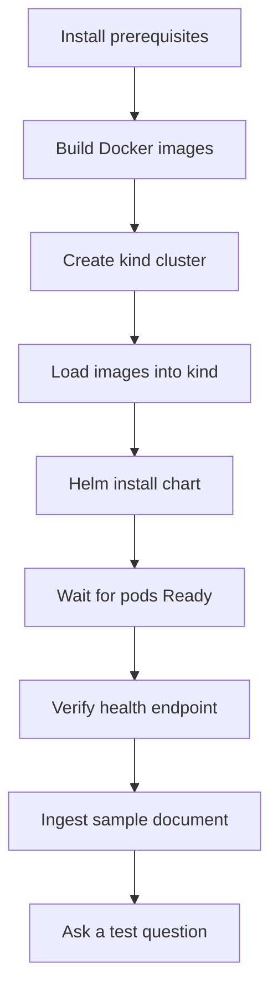
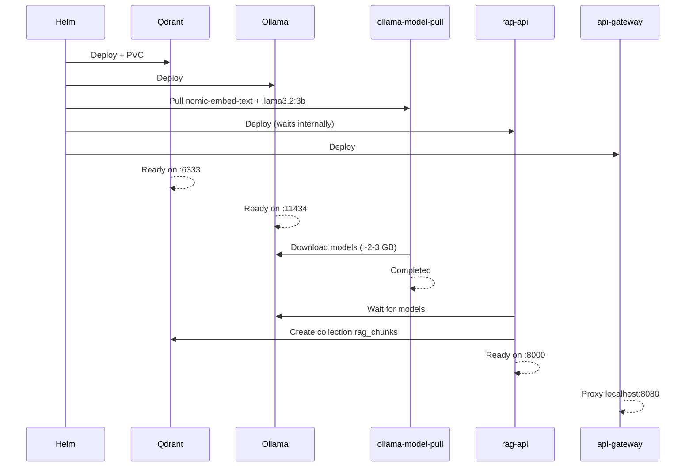
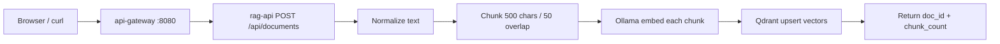
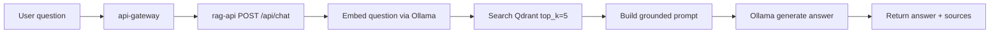

# RAG System — Logical Flow

This document walks through the system in execution order: how you deploy it, how it starts, how data moves through the RAG pipeline, and how to verify each step.

---

## 1. Big picture

```text
┌─────────────┐     ┌─────────────┐     ┌─────────────┐
│  You upload │ ──► │  rag-api    │ ──► │   Qdrant    │  vectors stored
│  documents  │     │  processes  │     │  (memory)   │
└─────────────┘     └──────┬──────┘     └─────────────┘
                           │
┌─────────────┐     ┌──────▼──────┐     ┌─────────────┐
│  You ask a  │ ──► │  rag-api    │ ◄──►│   Ollama    │  embed + generate
│  question   │     │  retrieves  │     │   (models)  │
└─────────────┘     └─────────────┘     └─────────────┘
```

**Write path (ingest):** text → chunk → embed → store in Qdrant  
**Read path (chat):** question → embed → search Qdrant → build prompt → Ollama answer

---

## 2. Deployment flow

Follow these steps in order. Each step depends on the previous one.



### Step-by-step

| Step | Command | What happens |
|------|---------|--------------|
| 1 | — | Ensure Docker, kind, kubectl, Helm are installed |
| 2 | `./scripts/build-images.sh` | Builds `rag-api:local` and `rag-frontend:local` |
| 3 | `kind create cluster --config kind-config.yaml --name rag-system` | Creates 1 control-plane + 1 worker; maps port 8080 |
| 4 | `./scripts/load-images.sh` | Copies local images into kind nodes |
| 5 | `helm upgrade --install rag-system ./helm/rag-system -n rag-system --create-namespace` | Deploys all Kubernetes resources |
| 6 | `kubectl get pods -n rag-system -w` | Wait until all Running pods show `1/1` and Job is `Completed` |
| 7 | `curl http://localhost:8080/health` | Confirms Ollama + Qdrant are reachable |
| 8 | Upload `sample-docs/k8s-networking.txt` via UI or API | Indexes knowledge base |
| 9 | Ask *"What is a Kubernetes Service?"* | Confirms full RAG loop |

**One-command shortcut:** `./scripts/deploy.sh` runs steps 2–5 automatically.

---

## 3. Cluster startup flow

When Helm installs the chart, components start in this logical order:



### Startup checklist

```bash
# 1. Infrastructure up
kubectl get pods -n rag-system -l app=qdrant
kubectl get pods -n rag-system -l app=ollama

# 2. Models downloaded
kubectl get job ollama-model-pull -n rag-system
kubectl logs -n rag-system job/ollama-model-pull | tail -5

# 3. Application ready
kubectl get pods -n rag-system -l app=rag-api
curl -s http://localhost:8080/health | jq .
```

**Expected health response:**

```json
{
  "status": "ok",
  "ollama": true,
  "qdrant": true,
  "embed_model": "nomic-embed-text",
  "llm_model": "llama3.2:3b"
}
```

**Typical wait time:** 5–10 minutes on first deploy (model download dominates).

---

## 4. Document ingestion flow

What happens when you upload a document:



### Detailed steps

| # | Stage | Code location | Output |
|---|-------|---------------|--------|
| 1 | Receive document | `main.py` → `ingest_document()` | title + raw text |
| 2 | Assign ID | `uuid.uuid4()` | `doc_id` |
| 3 | Chunk | `rag/chunker.py` | list of text segments |
| 4 | Embed | `rag/ollama_client.py` → Ollama `/api/embeddings` | vector per chunk |
| 5 | Index | `rag/qdrant_store.py` → upsert | points in `rag_chunks` collection |
| 6 | Respond | JSON response | `{ doc_id, title, chunk_count }` |

### Example (API)

```bash
curl -X POST http://localhost:8080/api/documents \
  -H 'Content-Type: application/json' \
  -d '{
    "title": "K8s Networking",
    "content": "A Service provides stable DNS and load-balanced access to pods."
  }'
```

**Expected response:**

```json
{
  "doc_id": "c243d63c-808c-44ea-8087-0b3354c6b397",
  "title": "K8s Networking",
  "chunk_count": 1,
  "message": "Document ingested successfully"
}
```

### Verify ingestion

```bash
curl -s http://localhost:8080/api/documents
```

Documents appear in the list. Vectors are visible in the Qdrant dashboard at http://localhost:6333/dashboard (collection: `rag_chunks`).

---

## 5. Chat / query flow

What happens when you ask a question:



### Detailed steps

| # | Stage | What happens |
|---|-------|--------------|
| 1 | Embed question | Same model as ingestion (`nomic-embed-text`) |
| 2 | Vector search | Qdrant cosine similarity, top 5 chunks |
| 3 | Prompt assembly | Context blocks + instruction to answer only from context |
| 4 | Generation | Ollama `llama3.2:3b` produces answer |
| 5 | Response | Answer text + source citations with scores |

### Example (API)

```bash
curl -X POST http://localhost:8080/api/chat \
  -H 'Content-Type: application/json' \
  -d '{"question": "What is a Kubernetes Service?"}'
```

**Note:** First chat request on a laptop can take **1–3 minutes** while Ollama loads the model into memory. Subsequent requests are faster.

### Verify chat

- Answer references concepts from your uploaded document
- `sources` array lists matching chunks with `doc_title` and `score`
- If no documents indexed, model responds that it does not know

---

## 6. Request routing flow

All browser and API traffic enters through one port:

```text
localhost:8080
       │
       ▼
  api-gateway (nginx)
       │
       ├── /health        → rag-api /health
       ├── /api/documents → rag-api
       ├── /api/chat      → rag-api
       └── /*             → rag-frontend (static UI)
```

Inside the cluster:

```text
rag-api.rag-system.svc:8000      ← application
ollama.rag-system.svc:11434      ← embeddings + LLM
qdrant.rag-system.svc:6333       ← vector search
rag-frontend.rag-system.svc:80   ← UI
```

---

## 7. Verification checklist

Use this after every deploy:

| Check | Command | Pass criteria |
|-------|---------|---------------|
| Pods running | `kubectl get pods -n rag-system` | 5 pods `1/1 Running`, Job `Completed` |
| Health | `curl -s localhost:8080/health` | `"status":"ok"` |
| UI loads | Open http://localhost:8080 | Upload + chat panels visible |
| Ingest works | POST sample document | Returns `chunk_count > 0` |
| List docs | `curl localhost:8080/api/documents` | Document appears in list |
| Chat works | POST question about uploaded content | Answer + sources returned |
| Qdrant UI | http://localhost:6333/dashboard | `rag_chunks` collection exists |

### Verified on this project (2026-06-28)

| Check | Result |
|-------|--------|
| Docker build (`rag-api`, `rag-frontend`) | Pass |
| Helm lint | Pass |
| kind deploy | Pass |
| Health endpoint | Pass (`status: ok`) |
| Document ingest | Pass (3 chunks indexed) |
| Document list | Pass |
| Chat | Pass after timeout/probe tuning (see note below) |

**Note:** Initial chat failed with `ReadTimeout` because Ollama generation exceeded 180s under cluster load. Fixed by increasing timeouts and limiting `num_predict` to 256 tokens. On resource-constrained hosts, allow 2–3 minutes per chat request.

---

## 8. Troubleshooting flow

Use this decision tree when something fails:

```text
Deploy fails?
├── kind cluster missing → run ./scripts/deploy.sh
├── ImagePullBackOff on rag-api/frontend → ./scripts/build-images.sh && ./scripts/load-images.sh
└── ImagePullBackOff on qdrant/ollama → check internet; docker pull images manually

Pods not Ready?
├── ollama-model-pull still running → wait; check: kubectl logs job/ollama-model-pull -n rag-system
├── rag-api CrashLoopBackOff → likely models not ready; wait for Job to complete
└── OOM / probe failures → reduce model size in values.yaml (e.g. gemma2:2b); increase host RAM

Health returns degraded?
├── ollama: false → kubectl logs deploy/ollama -n rag-system
└── qdrant: false → kubectl describe pod -l app=qdrant -n rag-system

Ingest fails?
├── 400 empty content → provide non-empty text
└── 503 not ready → wait for rag-api startup (models + Qdrant)

Chat returns error or timeout?
├── No documents indexed → ingest first
├── ReadTimeout → wait longer; Ollama is CPU-bound on kind
└── "I do not know" → question doesn't match uploaded content; try broader question
```

---

## 9. Cleanup flow

```bash
# Remove Helm release + namespace (keep kind cluster)
./scripts/cleanup.sh

# Remove everything including kind cluster
DELETE_CLUSTER=true ./scripts/cleanup.sh
```

---

## 10. Phase 2 evolution

The MVP runs all pipeline stages inside `rag-api`. The logical flow stays the same when you split services:

```text
Current MVP                         Phase 2
─────────────                       ───────
rag-api (all stages)        →       ingestion-service
                                    chunking-service
                                    embedding-service
                                    rag-orchestrator
```

See [ARCHITECTURE.md](ARCHITECTURE.md) for the target microservice layout.

---

## Related docs

| Document | Purpose |
|----------|---------|
| [README.md](../README.md) | Quick start, API reference, configuration |
| [ARCHITECTURE.md](ARCHITECTURE.md) | Component design, K8s resources, trade-offs |
